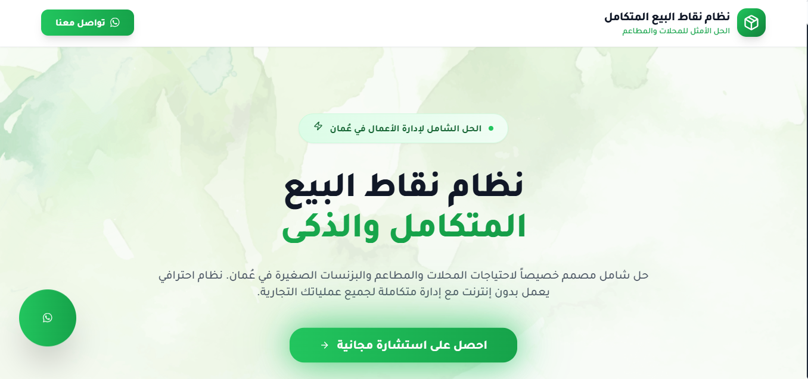

## 📄 About the Project

**POS System** is a streamlined point-of-sale and business management solution tailored for small businesses across the Gulf. It handles everything from sales and inventory to customer tracking and reporting — all from a clean, easy-to-use interface. Simple setup. No monthly fees. Full onboarding and support.

## 📷 Project Screenshot

---

## 🌐 Live Demo

**Explore it here**: [https://posmanager.netlify.app/](https://pos-oman.netlify.app/)  

---

## ✨ Key Features

- 🧾 Fast, reliable point-of-sale system  
- 📦 Inventory and stock management  
- 👥 Customer profiles with purchase history  
- 📊 Real-time sales and performance reports  
- 🔔 Low-stock alerts and multi-store support  
- 🌐 Arabic-friendly interface with English support  
- 💼 One-time setup with full customization & training  

Perfect for retail stores, cafes, barbershops, salons, and more — POS Manager helps business owners stay on top of operations with zero tech hassle.

---

## 🧰 Tech Stack

- ⚛️ [React](https://reactjs.org/) — fast, interactive UI  
- 💻 [TypeScript](https://www.typescriptlang.org/) — clean, scalable logic  
- 🎨 [Tailwind CSS](https://tailwindcss.com/) — modern styling system  
- 🧩 [shadcn/ui](https://ui.shadcn.dev/) — accessible component set  
- 🔧 Native integration with Android tablets and receipt printers  
